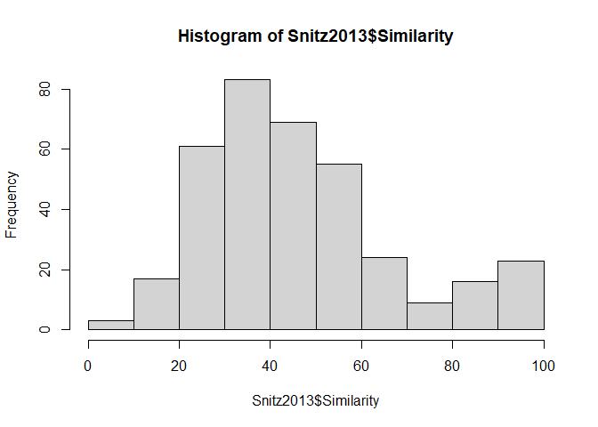

<!-- README.md is generated from README.Rmd. Please edit that file -->

# pyrfume

<!-- badges: start -->

[](https://github.com/pyrfume/rfume/actions/workflows/R-CMD-check.yaml)
<!-- badges: end -->

[Pyrfume](https://pyrfume.org/) is an effort to extensively curate data
related to olfactory psychophysics, to transparently and automatically
determine how well models make sense of this data, and to inform
experimental design for olfactory research at large.

## Installation

You can install the released version of pyrfume from
[CRAN](https://CRAN.R-project.org) with:

``` r
install.packages("pyrfume")
#> Installing package into 'C:/Users/rpellegrino/AppData/Local/Temp/Rtmp21DE4t/temp_libpath6f3076f77858'
#> (as 'lib' is unspecified)
#> Warning: package 'pyrfume' is not available for this version of R
#> 
#> A version of this package for your version of R might be available elsewhere,
#> see the ideas at
#> https://cran.r-project.org/doc/manuals/r-patched/R-admin.html#Installing-packages
```

You can install the development version of pyrfume from
[GitHub](https://github.com/pyrfume/rfume):

``` r
library(devtools)
#> Loading required package: usethis
install_github("pyrfume/rfume", force = TRUE)
#> Downloading GitHub repo pyrfume/rfume@HEAD
#> ── R CMD build ─────────────────────────────────────────────────────────────────
#>       ✔  checking for file 'C:\Users\rpellegrino\AppData\Local\Temp\Rtmpgxpnc3\remotes142c58a47329\pyrfume-rfume-23959e3/DESCRIPTION' (367ms)
#>       ─  preparing 'pyrfume':
#>    checking DESCRIPTION meta-information ...     checking DESCRIPTION meta-information ...   ✔  checking DESCRIPTION meta-information
#>       ─  checking for LF line-endings in source and make files and shell scripts
#>   ─  checking for empty or unneeded directories
#>   ─  building 'pyrfume_0.0.0.9000.tar.gz'
#>      
#> 
#> Installing package into 'C:/Users/rpellegrino/AppData/Local/Temp/Rtmp21DE4t/temp_libpath6f3076f77858'
#> (as 'lib' is unspecified)
```

## Example

This is a basic example which shows you how retrieve a behavior dataset

``` r

Snitz2013 <- pyrfume::load_data("snitz_2013/behavior.csv")
hist(Snitz2013$Similarity)
```


